# Pawsitive Daycare

## Kevin Phuong and John Niduelan

### [Live Site](https://zippy-tartufo-996534.netlify.app/)

## Project Links:

- [GitHub Repository - Documentation](https://github.com/pawsitive-daycare/Part-A-Documentation)
- [GitHub Repository - Client](https://github.com/pawsitive-daycare/Client)
- [GitHub Repository - Server](https://github.com/pawsitive-daycare/PAWsitiveDaycare-backend)

---

## Purpose

The purpose of this project is to help with being able to connect the business with potential clients and have them have a seamless and easier way to communicate information. Our main goal for this application is to ensure that all necessary data and information about the service is provided in one place so that clients can access whichever information they need to at ease. The use of the application is through the seamless booking and payment service which will be provided on the website to help clients book the services that the business provides through their own pace and without the need of phone call.

## Functionality/features

- **Register/login**: this allows users to create and login to an account securely to access features
- **Dashboard**: a hub where users can manage thier account, view current bookings and access any saved information. This includes the following features:

  - **Pet profiles**: Users can create detailed profiles of their pet/s and can be updated to their preferences including breed, age, dietary needs, medical history and special instruction that will allow the business to provide the best possible service

  - **Booking system**: allows easy scheduling for users to book a preferred time and dates for services

- **Contact Us section**: provides ways for users to reach the business
- **services Information**: outlines the cost of offered services information of the business to help users with decisions.

  ### Updated features - Dec 12, 2024

  The **Pet Profile** feature has been removed from the original MVP due to time constraints and the complexity of implementation. However, it has been added to our wishlist for future development.

## Target Audience

The main target audience of Pawsitive Daycare

Pet owners who are :

1. Travel overseas often for work and need for pet care when they are away
2. Have busy schedule during the day but want their fur companions have outdoor time and excercise
3. Have limited mobility or condition that makes caring for their pet/s challenging

## Tech stack

Pawsitive Daycare is built with

- **M**ongoDB: A flexible NoSQL database for efficient data storage.
- **E**xpress: A Node.js web framework for smooth routing and middleware.
- **R**eact: A JavaScript library for dynamic front-end development.
- **N**ode.js: Powers our server-side operations and enhances functionality.

Additional technologies we used:

- HTML and CSS: Foundational for structuring and styling our user interface.
- Mongoose: Facilitates MongoDB object modeling and validation.
- Jest: A JavaScript testing framework used for unit and integration testing to ensure code quality and reliability.
- Nodemon: A development tool that automatically restarts the server when file changes are detected, streamlining the development process.

---

## Dataflow Diagram

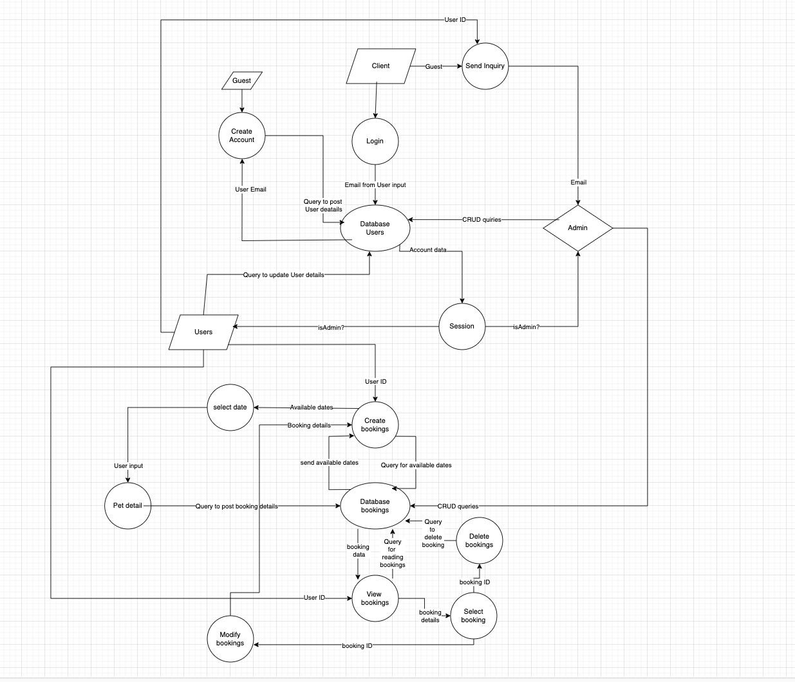

## Application Architecture Diagram

## User Stories

User stories progress, November 15:

User/client

As a : Pet owner user  
I want to: be able to easily register and login to my account  
So that: i am able to access my dashboard and manage bookings and profile

As a : Pet owner user  
I want to: be able to book a daycare for my pets online  
So that: i don’t have to worry about caring for them when i’m busy

As a : Pet owner user  
I want to: be able to make a profile for my pets  
So that: I can put all of my pets records/information for best care instructions

As a : Pet owner user  
I want to: be able to view and select from the offered services  
So that: I can choose what services I want for my pet’s needs

Business

As a : manager/admin  
I want to: access an admin dashboard where i can manage bookings and schedule  
So that: i can allocate tasks to staff members

As a : manager/admin  
I want to: manage user roles in the system  
So that: i can manage sensitive information and can only be accessed by authorised staff

User stories progress, November 16:

Here, we've implemented our user stories the true "persona" effect that highlight the purpose of our website, the diverse audience we aim to serve, and the meaningful impact our website can have in their lives.
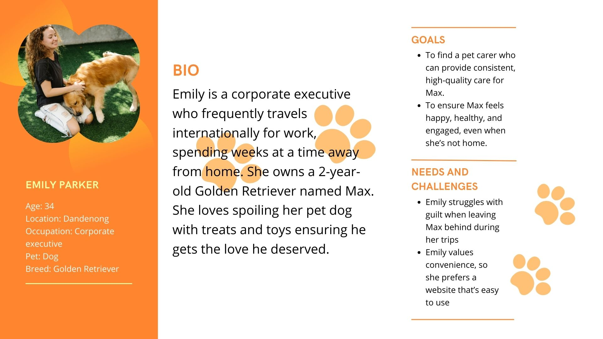
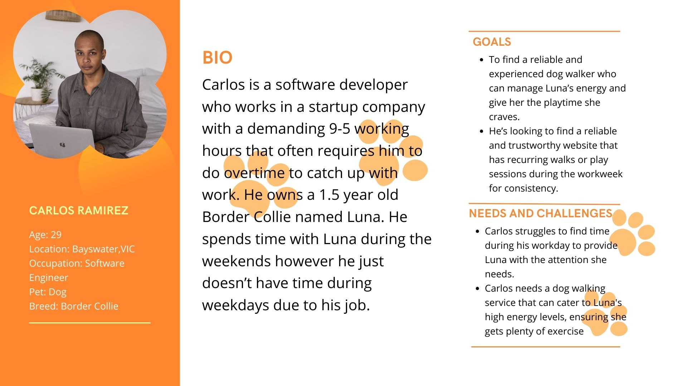
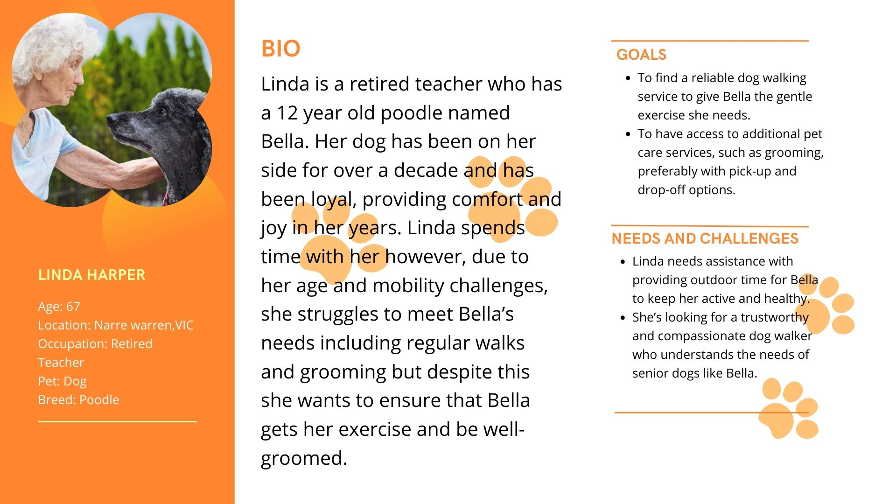

User stories progress, November 17:

We refined our user stories by incorporating detailed personas aligned with our primary goals and key features for the website.

Register/login:

As: Emily  
I want to: be able to quickly register and log in to my account  
so that: I can manage Max’s care services on the go, even when I’m travelling internationally

As: Linda  
I want: a simple and accessible login option  
so that: I can manage Bella’s bookings without any technical difficulties

Pet profiles:

As: Carlos  
I want to: update Luna’s profile with her energy levels and activity preferences  
so that: her walker can tailor her outings

As: Linda  
I want to: include Bella’s medical needs and limitations in her profile  
so that: caregivers can ensure she’s comfortable and safe

Booking system:

As: Carlos  
I want to: schedule Luna’s walks during work hours  
so that: she gets the exercise she needs while I’m at the office

User Dashboard:

User  
As: Emily  
i want to: access a user-friendly dashboard where i can view and manage recurring bookings  
so that: I can save time when planning Max’s daycare visits

As: Linda  
I want to: be able to create,read,update and delete any information in my dashboard  
so that: i am able to organise and manage my account

Contact Us section:

As: Linda  
I want to: use the contact form to make special requests for Bella’s care  
so that: her unique needs are met

As: Emily  
I want to: be able to have a quick way to contact support  
so that: I can ask questions about availability while planning my trips

Services Information:

As: Carlos  
I want to: see clear pricing details  
so that: I can choose premium services for Luna within my budget

## Wireframes

The wireframes for our project have been included below and can also be accessed at this [link](https://www.figma.com/design/96baP2jlU3NRj2xUBu0SNX/Wireframe?node-id=59-92&node-type=frame&t=Ij2hnqVLK4vRaEmt-0)

## Project Management

### Task Delegation

This is the first time the collaborators are working together for a team. Each member has been assigned tasks based on their individual strengths and areas for growth.

**Kevin Phoung** : Kevin is in charge of the frontend development, including overall design and visual aesthetics.

**John Niduelan** : John is responsible for backend server development and general task management.

- [Trello Project Board](https://trello.com/invite/b/673454d54f89a5229f48eeaf/ATTI6efffa00ea68d2fa3d7c7d2a3b0c95f3AB78F6DB/fullstack-app)

### Part A

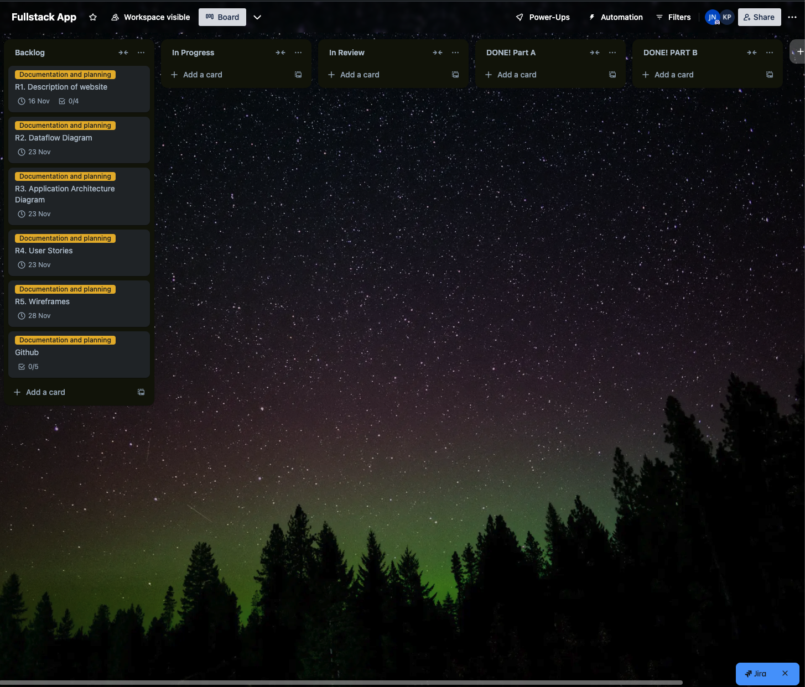
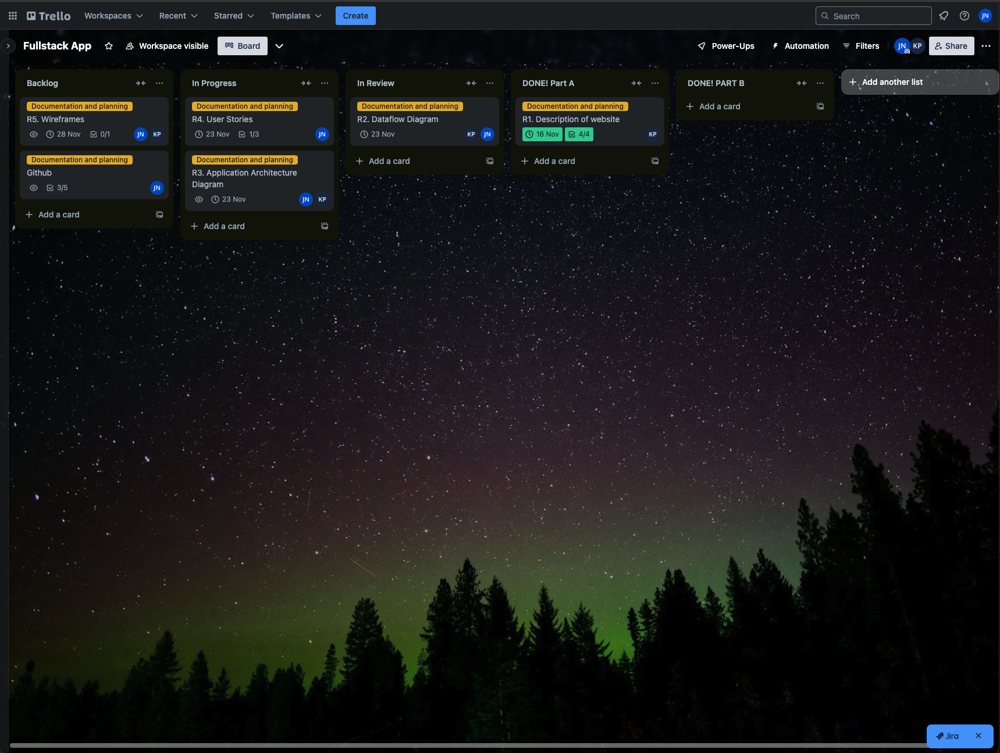
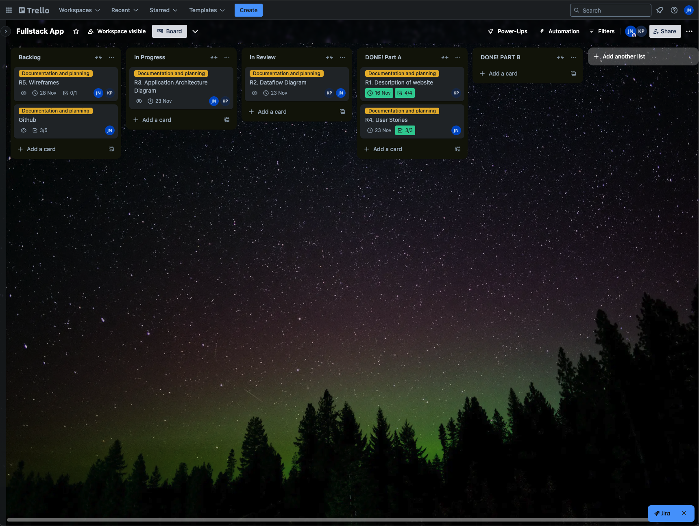

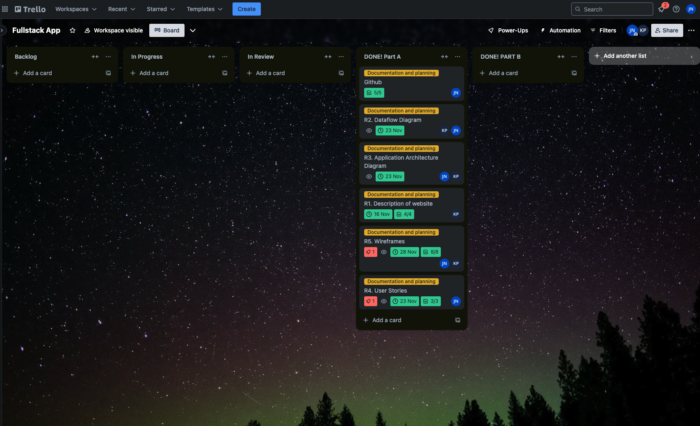

### Part B

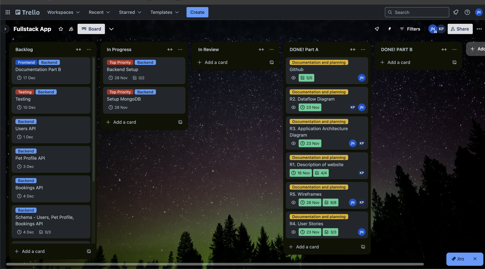

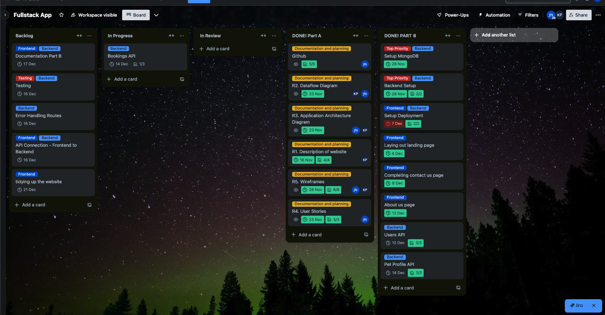

## Testing documentation

### Development testing

#### User
- Signup

 

- Login

 

- Get user by id

  

- Get all users

 

- Update User

 

- Delete User

 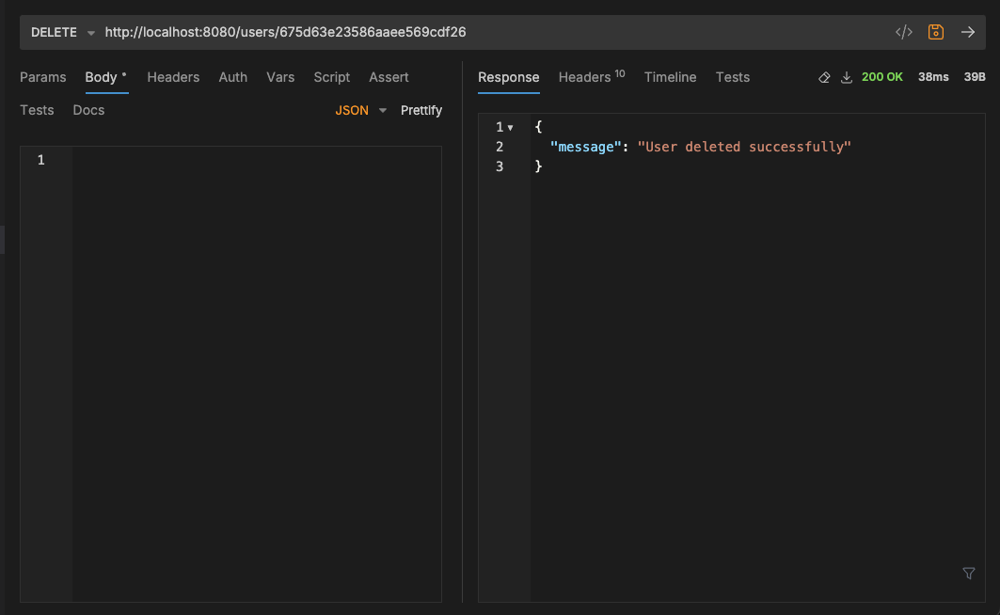

#### Booking

 - Create booking

 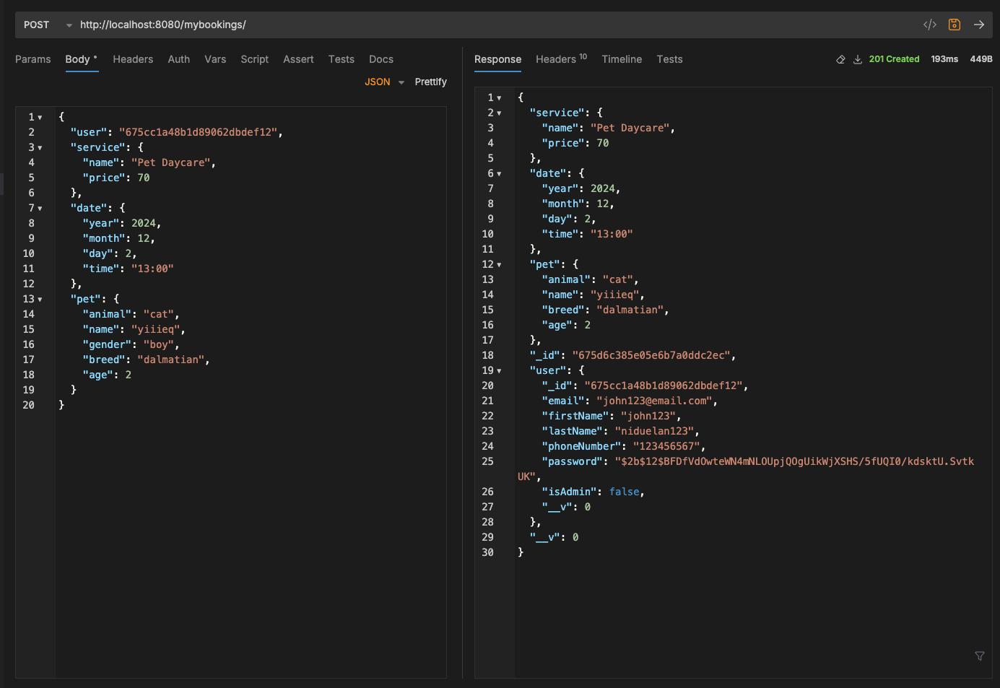

 - Delete booking

 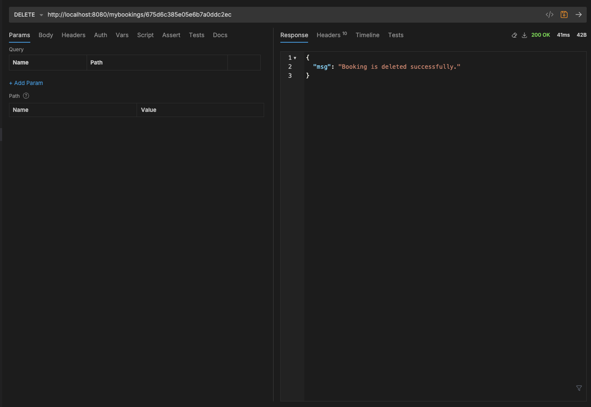

 - getAllBooking

 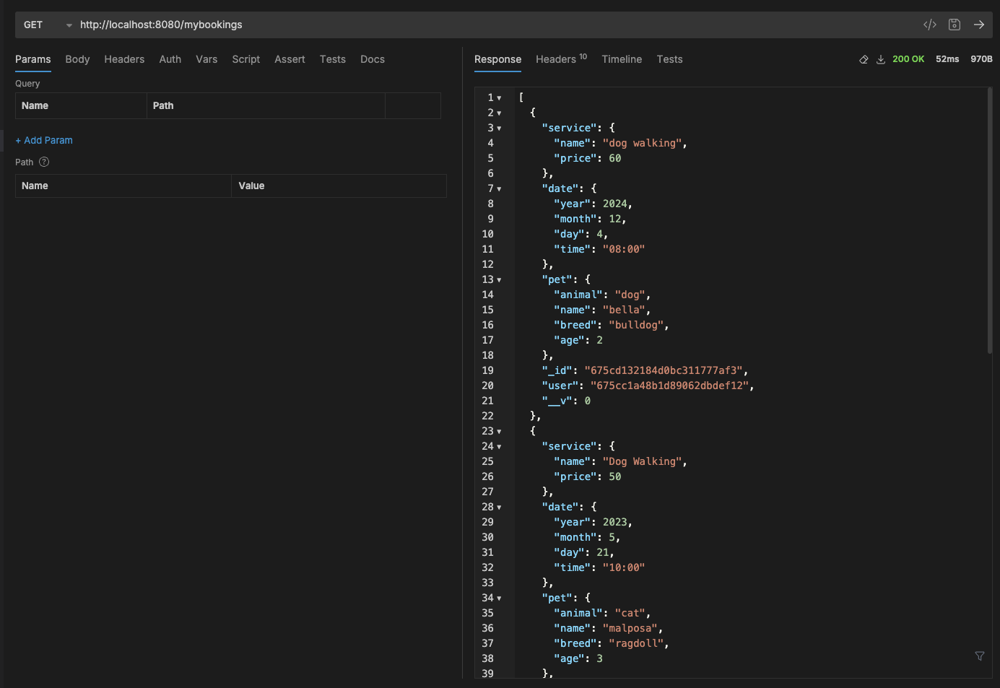

 - getUserBooking

 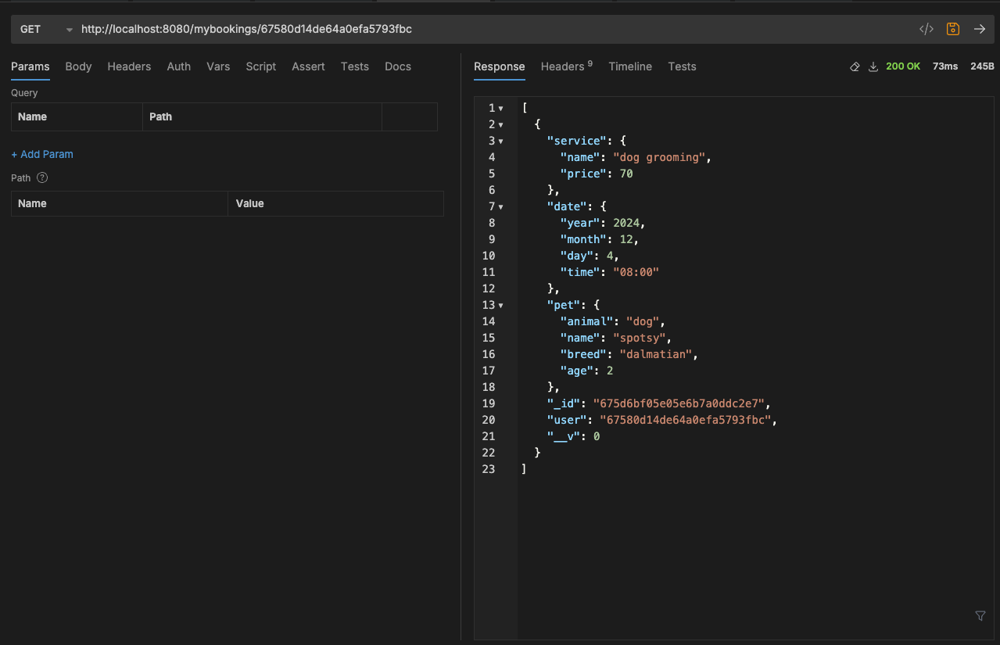

### Production Test

### Framework Test

  

    Testing using Jest
  

  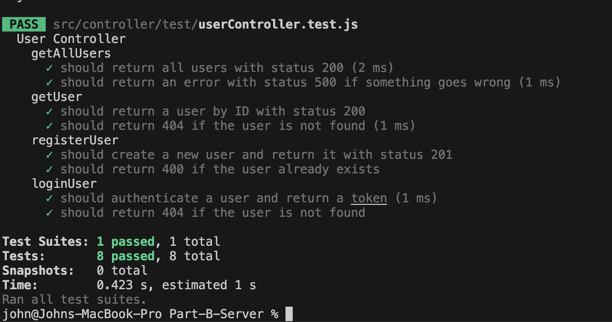

